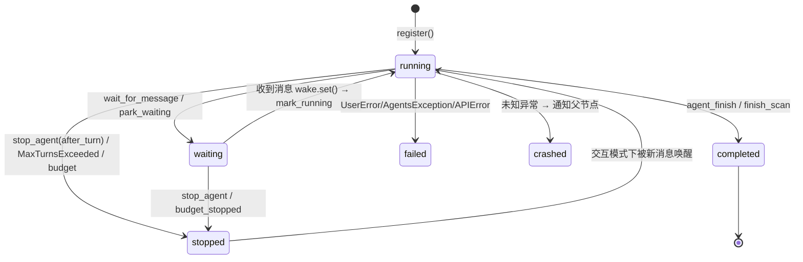
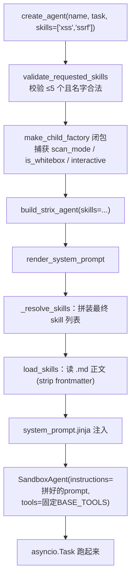

# Strix 多 Agent 架构

> 本文说明 Strix 如何用"一棵异步 agent 树"来分发和协作完成渗透/代码审计任务，以及 skill 如何变成子 agent 的能力。所有引用均带 `文件:行号`。

## 核心结论（先读这三条）

1. **多 agent 不是多进程/多容器**，而是**单进程内的一棵 asyncio 协程树**。所有 agent 共享同一个 sandbox 容器（`runner.py:219` 把 `bundle["session"]` 注入每个 agent 的 context）。加 agent 只加协程，不加容器。
2. **agent 间通信不是消息队列**，而是把消息**直接追加进目标 agent 的 SDK 对话历史**（`session.add_items`），再用 `asyncio.Event` 唤醒它（`agents.py:123-153`）。
3. **skill 不是"能力"而是"知识"**。所有 agent 的工具集完全相同（`factory.py:329`），skill 只改系统提示词。"专精"是提示词专精，不是工具专精。

## 整体架构

```
        AgentCoordinator（单一状态中枢，asyncio.Lock 保护）
        │  statuses / parent_of / names / pending_counts / runtimes
        │
   root "strix"  ──create_agent──▶  child A ──▶ grandchild
   (asyncio.Task)                   (asyncio.Task)
        每个 agent = 一个 SDK Agent + 独立 SQLiteSession + 一个 asyncio.Task
        所有 agent 共享同一个 sandbox session（bundle["session"]）
```

三个角色：

| 角色 | 位置 | 职责 |
|---|---|---|
| SDK `Agent` + `Runner.run_streamed` | `execution.py:352` | 单个 agent 的推理循环 |
| `AgentCoordinator` | `core/agents.py` | 唯一持有图状态、消息、runtime、resume 快照的对象 |
| `agents_graph` 工具集 | `tools/agents_graph/tools.py` | agent 操作这棵树的 6 个工具 |

`agents_graph` 的 6 个工具：`view_agent_graph` / `create_agent` / `send_message_to_agent` / `wait_for_message` / `agent_finish` / `stop_agent`。

## 一、任务分发：`create_agent`

父 agent 调用 `create_agent(name, task, skills, inherit_context)`（`tools.py:369`）：

1. 工具从 context 拿到 `spawn_child_agent` 闭包（runner 在 `runner.py:203` 注入）。
2. `spawn_child_agent`（`execution.py:121`）：
   - `child_id = uuid[:8]`
   - `factory(name, skills)` 用请求的 skills 构建子 Agent
   - `coordinator.register(child_id, ..., parent_id)` 登记到图，状态 `running`
   - `_start_child_runner` → `asyncio.create_task(_child_loop())` **detached 并发跑起来**（`execution.py:574`）
3. 父 agent **不阻塞**，工具立即返回 `child_id`，父继续自己的循环。

`inherit_context=True` 时把父的 `turn_input` 作为 `parent_history` 传给子做背景（`tools.py:464`）。

## 二、Agent 间通信：inbox 模型

没有共享队列，消息**直接追加进目标的 SDK session** 当成一条 user 消息：

- `send_message_to_agent` → `coordinator.send()`（`agents.py:123`）：
  - `session.add_items([...])` 把消息塞进目标对话历史
  - `pending_counts[target] += 1`
  - `runtime.wake.set()` 唤醒目标
  - 交互模式下若目标正在跑且 `interrupt_on_message`，`stream.cancel(mode="immediate")` 打断当前 turn
- 消息被格式化成 `[Message from X (id) | type=... | priority=...]` 注入（`agents.py:250`）

## 三、等待与唤醒：`wait_for_message`

父 spawn 完孩子后通常调 `wait_for_message`（`tools.py:237`）：

- 先 `consume_pending` 看有无积压消息，有则直接返回
- 没有则 `park_waiting`（状态 `waiting`）+ `asyncio.wait_for(coordinator.wait_for_message(me), timeout)`
- `coordinator.wait_for_message`（`agents.py:155`）是个 `asyncio.Event` 循环：清 event → `await wake.wait()`，被 `send()` 里的 `wake.set()` 唤醒

## 四、完成与回报：`agent_finish` / `finish_scan`

子 agent 干完调 `agent_finish`（`tools.py:497`）：

1. 渲染结构化 completion report（summary/findings/recommendations）
2. `coordinator.send(parent_id, {type:"completion", priority:"high"})` —— **回报自动进父的 inbox** 并唤醒父
3. `set_status(me, "completed")`，子 task 自然结束

root agent 则调 `finish_scan`（对 root 调 `agent_finish` 会被拒绝，`tools.py:551`）。

## 五、停止与级联：`stop_agent`

`stop_agent(target, cascade=True)`（`tools.py:612`）用 SDK 的 `stream.cancel(mode="after_turn")` 优雅停止 —— 当前 turn 跑完存好 session 再停。`cascade=True` 时 `cancel_descendants_graceful` 按子树 leaf-first 逐个 stop（`agents.py:206`）。

## 六、持久化与 resume

- coordinator 每次状态变化 `_maybe_snapshot()` 写 `agents.json`（`agents.py:298`），SDK 对话存 `agents.db`。
- resume 时 `restore()` 恢复图 + `respawn_subagents()`（`execution.py:185`）把还在 `running/waiting` 的子 agent 重新拉起接着跑。

## 完整时序图

```mermaid
sequenceDiagram
    autonumber
    participant U as User/CLI
    participant RN as run_strix_scan<br/>(runner.py)
    participant CO as AgentCoordinator<br/>(agents.py)
    participant RT as Root "strix"<br/>(asyncio.Task)
    participant SBX as 共享 sandbox session
    participant CH as Child Agent<br/>(asyncio.Task)
    participant DB as agents.db / agents.json

    Note over RN,SBX: ① 启动：拉起唯一容器 + 建图
    U->>RN: run_strix_scan(scan_config)
    RN->>SBX: session_manager.create_or_reuse()（起 1 个容器）
    RN->>CO: register(root_id, parent=None) → status=running
    RN->>DB: open_agent_session(root) + snapshot(agents.json)
    RN->>RT: run_agent_loop(root_task)

    Note over RT,CH: ② 任务分发：create_agent
    RT->>RT: Runner.run_streamed 推理，决定拆分
    RT->>CO: create_agent(name, task, skills)
    CO->>CO: child_id=uuid[:8]；register(child, parent=root)
    CO->>DB: open_agent_session(child) + snapshot
    CO-)CH: asyncio.create_task(_child_loop) 【detached 并发】
    CO-->>RT: 立即返回 {agent_id: child_id}

    Note over RT,CH: ③ 父不阻塞，选择等待
    RT->>CO: wait_for_message(me, timeout=600)
    CO->>CO: park_waiting(root) → status=waiting
    CO->>CO: await wake.wait()  (asyncio.Event 挂起)

    Note over CH,SBX: ④ 子 agent 并发干活（同一个容器）
    CH->>SBX: session.exec(shell / grep / code_graph ...)
    SBX-->>CH: 命令输出
    CH->>CH: create_vulnerability_report(...) 落库

    Note over CH,RT: ⑤ 可选：中途通信
    CH->>CO: send_message_to_agent(root, finding)
    CO->>DB: session.add_items(root) 追加为 user 消息
    CO->>CO: pending_counts[root]++ ; wake.set()
    Note right of CO: 交互模式下若 root 在跑<br/>stream.cancel(immediate) 打断

    Note over CH,RT: ⑥ 子完成 → 自动回报父
    CH->>CO: agent_finish(summary, findings)
    CO->>DB: send(root, completion report) → add_items + pending++
    CO->>CO: wake.set() 唤醒 root
    CO->>CO: set_status(child, completed)
    CH-->>CH: _child_loop 结束，Task 退出

    Note over RT: ⑦ 父被唤醒，消费 inbox
    CO-->>RT: wait 返回 (message_arrived)
    RT->>CO: consume_pending(root) → 取回 completion report
    RT->>RT: mark_running；继续推理/派新任务

    Note over RT,U: ⑧ 收尾
    RT->>CO: finish_scan(scan_completed=true)
    RN->>SBX: session_manager.cleanup()（销毁容器）
    RN-->>U: 执行报告 + 漏洞列表
```

## 单个 Agent 状态机

对应 `AgentCoordinator.statuses`：



## 七、Skill 如何变成子 agent 的能力

### 7.1 skill 是什么

一个 skill = 一个 markdown 文件 `strix/skills/<category>/<name>.md`（frontmatter + 正文）。正文是**纯文本领域知识/打法**（如 `vulnerabilities/xss.md` 的 payload、绕过、验证流程）。

分类：

```
vulnerabilities/  xss, sql_injection, ssrf, idor, rce, xxe ...   ← 用户可选
technologies/ frameworks/ cloud/ protocols/ reconnaissance/     ← 用户可选
tooling/          agent_browser, python                          ← always-on
coordination/     root_agent, source_aware_whitebox             ← 内部（不可选）
scan_modes/       deep, ...                                       ← 内部
```

`_INTERNAL_SKILL_CATEGORIES = {scan_modes, coordination}`（`skills/__init__.py:12`）对用户不可见。

### 7.2 关键：工具集固定，skill 不加工具

`factory.py:329-393`：

```python
_BASE_TOOLS = (think, load_skill, todo..., note..., web_search,
               create_vulnerability_report, proxy..., view_agent_graph,
               send_message_to_agent, wait_for_message, create_agent,
               stop_agent, coverage..., trace_symbol)

if is_root:  tools = [*_BASE_TOOLS, finish_scan]
else:        tools = [*_BASE_TOOLS, agent_finish]
```

**唯一区别是 root 挂 `finish_scan`、child 挂 `agent_finish`。** 加上 `SandboxAgent` 自带的 `Filesystem` + `Shell`。skills 参数不出现在 tools 里 —— "XSS Specialist" 和 "SQLi Validator" 工具完全相同，差异 100% 在系统提示词。

### 7.3 变换链



### 7.4 `_resolve_skills`：请求的 skill 只是一部分（`prompt.py:31`）

最终注入顺序（去重）：

1. 调用方请求的（`["xss","ssrf"]`）
2. `scan_modes/<mode>`（always）
3. `tooling/agent_browser`（always）
4. `tooling/python`（always）
5. `coordination/root_agent`（**仅 root** —— 这就是为什么只有 root 懂拆任务）
6. `coordination/source_aware_whitebox` + `custom/source_aware_sast`（**仅白盒**）

白盒能力 = 白盒模式下自动多挂两个 coordination/custom skill。`STRIX_DISABLE_FIX_AGENTS` = 往 `root_agent` skill 正文追加一段 directive（`prompt.py:99-104`）。

### 7.5 jinja 注入（`system_prompt.jinja:433`）

```jinja

<{{ skill_name }}>
{{ get_skill(skill_name) }}     ← 把 .md 正文原样塞进去
</{{ skill_name }}>


<available_skills>              ← 列出"还没加载但可按需拉取"的目录
- vulnerabilities: xss, sql_injection, ...
</available_skills>
```

### 7.6 两种获取 skill 的方式

| | 时机 | 机制 | 持久性 |
|---|---|---|---|
| `create_agent(skills=[...])` | spawn 时 | 烘焙进子 agent 的 system prompt | 永久 |
| `load_skill(["xss"])` 工具 | 运行中任意时刻 | .md 正文作为一次 tool result 返回（`load_skill/tool.py`） | 临时（仅在对话历史） |

`available_skills` 目录告诉 agent："这些没预装，需要时可 `load_skill` 现拉"。

---

**总结**：Strix 的"专精"是提示词专精，不是工具专精。`create_agent(skills=[...])` 做的是挑几个 markdown 知识文件正文，连同 always-on 的 scan_mode/tooling（及 root/whitebox 专属 coordination）拼进子 agent 的 system prompt；工具集所有 agent 恒定相同。整棵树在单进程单容器内以 asyncio 协程并发，靠 inbox（写对方 SDK session + Event 唤醒）协作，coordinator 统一管理状态与 resume。
